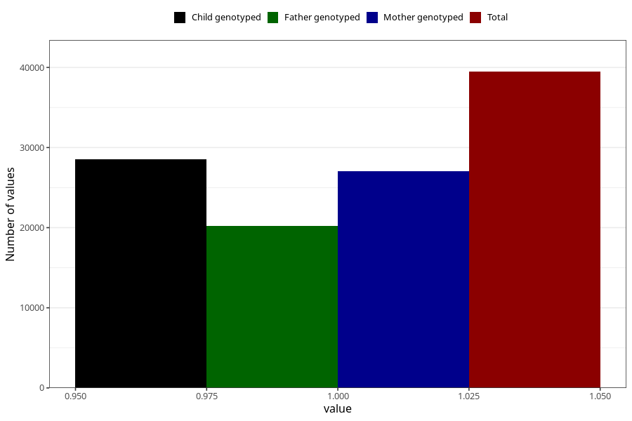

# behavioral_problems_difficult_and_unruly_no_8y
Variable mapping to questionnaire: q9, question NN56.
- Number of values:

| Value | Total | Child genotyped | Mother genotyped | Father genotyped |
| ----- | ----- | --------------- | ---------------- | ---------------- |
| Missing | 74159 | 46911 | 44708 | 29962 |
| Non-missing | 39464 | 28520 | 27061 | 20256 |
| 1 | 39464 | 28520 | 27061 | 20256 |

