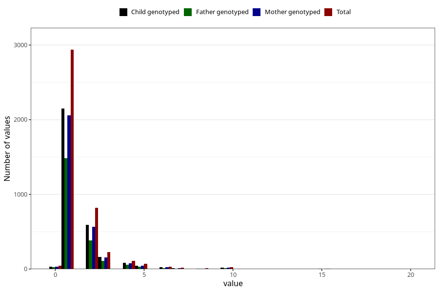

# bronchitis_freq_3y
Variable mapping to questionnaire: q6, question GG144.
- Number of values:

| Value | Total | Child genotyped | Mother genotyped | Father genotyped |
| ----- | ----- | --------------- | ---------------- | ---------------- |
| Missing | 109309 | 72299 | 68771 | 48091 |
| Non-missing | 4314 | 3132 | 2998 | 2127 |
| 0 | 42 | 31 | 31 | 23 |
| 1 | 2937 | 2152 | 2061 | 1482 |
| 2 | 821 | 591 | 566 | 386 |
| 3 | 230 | 162 | 153 | 110 |
| 4 | 113 | 83 | 78 | 57 |
| 5 | 68 | 43 | 42 | 31 |
| 6 | 34 | 22 | 22 | 14 |
| 7 | 17 | 10 | 9 | 5 |
| 8 | 11 | 8 | 8 | 4 |
| 9 | 1 | 1 | 1 | 0 |
| 10 | 28 | 18 | 18 | 9 |
| 12 | 2 | 2 | 2 | 2 |
| 14 | 2 | 2 | 2 | 1 |
| 15 | 4 | 3 | 3 | 2 |
| 16 | 1 | 1 | 0 | 0 |
| 18 | 1 | 1 | 1 | 1 |
| 20 | 2 | 2 | 1 | 0 |

