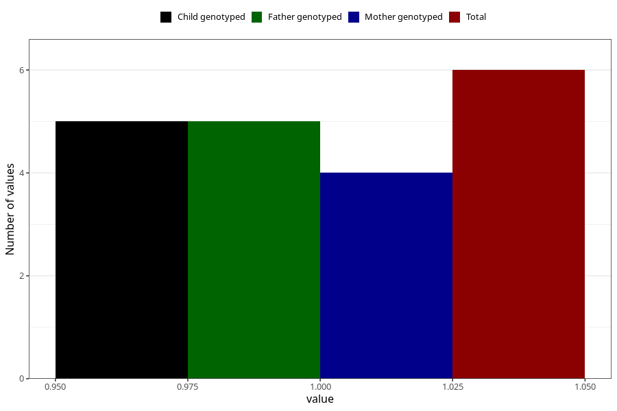

# chronic_fatigue_syndrome_me_8y
Variable mapping to questionnaire: q9, question NN28.
- Number of values:

| Value | Total | Child genotyped | Mother genotyped | Father genotyped |
| ----- | ----- | --------------- | ---------------- | ---------------- |
| Missing | 113617 | 83350 | 71765 | 50213 |
| Non-missing | 6 | 5 | 4 | 5 |
| 1 | 6 | 5 | 4 | 5 |

