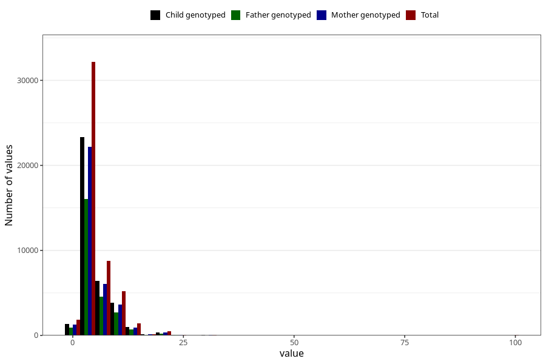

# common_cold_freq_3y
Variable mapping to questionnaire: q6, question GG129.
- Number of values:

| Value | Total | Child genotyped | Mother genotyped | Father genotyped |
| ----- | ----- | --------------- | ---------------- | ---------------- |
| Missing | 63424 | 39039 | 37221 | 24870 |
| Non-missing | 50199 | 36392 | 34548 | 25348 |
| 25th percentile | 3 | 3 | 3 | 3 |
| 50th percentile | 4 | 4 | 4 | 4 |
| 75th percentile | 6 | 6 | 6 | 6 |

