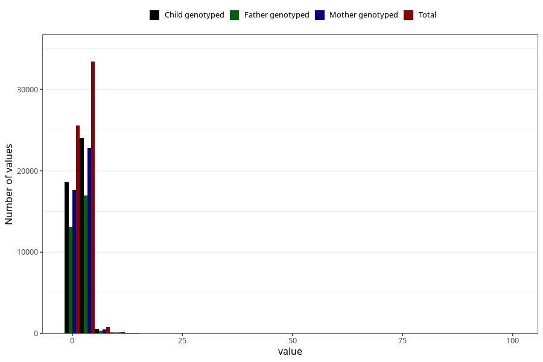

# common_cold_freq_6m
Variable mapping to questionnaire: q4, question DD264.
- Number of values:

| Value | Total | Child genotyped | Mother genotyped | Father genotyped |
| ----- | ----- | --------------- | ---------------- | ---------------- |
| Missing | 53568 | 35933 | 30588 | 19591 |
| Non-missing | 60055 | 47422 | 41181 | 30627 |
| 25th percentile | 1 | 1 | 1 | 1 |
| 50th percentile | 2 | 2 | 2 | 2 |
| 75th percentile | 2 | 2 | 2 | 2 |

