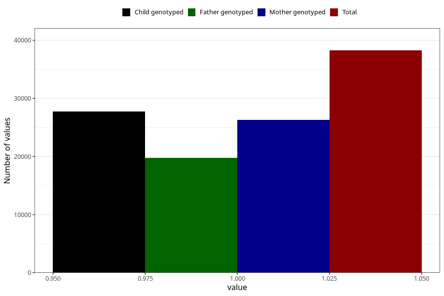

# concentration_or_attention_difficulties_no_8y
Variable mapping to questionnaire: q9, question NN48.
- Number of values:

| Value | Total | Child genotyped | Mother genotyped | Father genotyped |
| ----- | ----- | --------------- | ---------------- | ---------------- |
| Missing | 75368 | 47702 | 45430 | 30466 |
| Non-missing | 38255 | 27729 | 26339 | 19752 |
| 1 | 38255 | 27729 | 26339 | 19752 |

