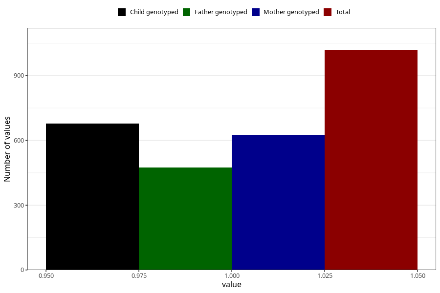

# delayed_or_abnormal_language_development_currently_8y
Variable mapping to questionnaire: q9, question NN41.
- Number of values:

| Value | Total | Child genotyped | Mother genotyped | Father genotyped |
| ----- | ----- | --------------- | ---------------- | ---------------- |
| Missing | 112604 | 74754 | 71143 | 49744 |
| Non-missing | 1019 | 677 | 626 | 474 |
| 1 | 1019 | 677 | 626 | 474 |

