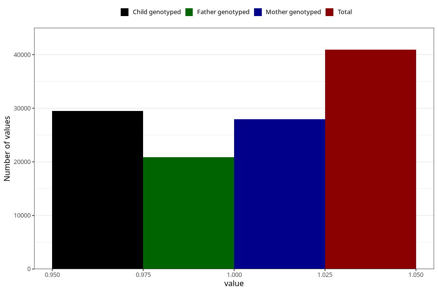

# delayed_psychomotor_development_no_8y
Variable mapping to questionnaire: q9, question NN36.
- Number of values:

| Value | Total | Child genotyped | Mother genotyped | Father genotyped |
| ----- | ----- | --------------- | ---------------- | ---------------- |
| Missing | 72708 | 45924 | 43780 | 29305 |
| Non-missing | 40915 | 29507 | 27989 | 20913 |
| 1 | 40915 | 29507 | 27989 | 20913 |

