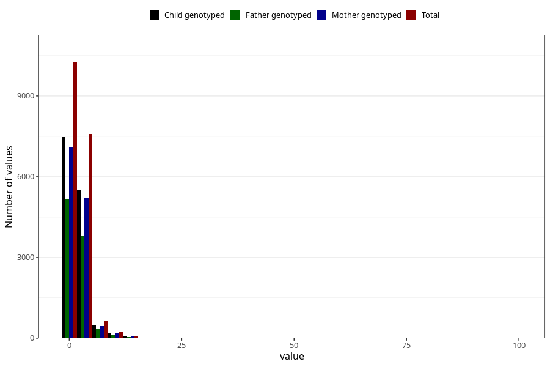

# ear_infection_freq_3y
Variable mapping to questionnaire: q6, question GG138.
- Number of values:

| Value | Total | Child genotyped | Mother genotyped | Father genotyped |
| ----- | ----- | --------------- | ---------------- | ---------------- |
| Missing | 94740 | 61701 | 58709 | 40747 |
| Non-missing | 18883 | 13730 | 13060 | 9471 |
| 25th percentile | 1 | 1 | 1 | 1 |
| 50th percentile | 1 | 1 | 1 | 1 |
| 75th percentile | 2 | 2 | 2 | 2 |

