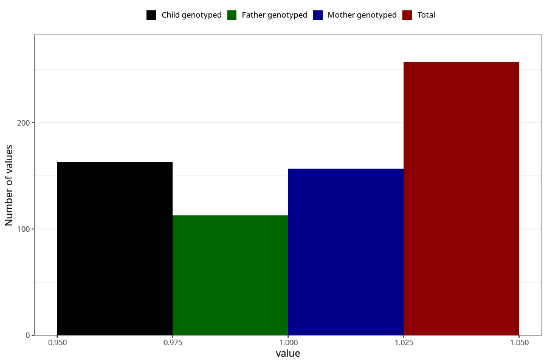

# epilepsy_7y
Variable mapping to questionnaire: q8, question JJ434.
- Number of values:

| Value | Total | Child genotyped | Mother genotyped | Father genotyped |
| ----- | ----- | --------------- | ---------------- | ---------------- |
| Missing | 113366 | 75268 | 71612 | 50105 |
| Non-missing | 257 | 163 | 157 | 113 |
| 1 | 257 | 163 | 157 | 113 |

