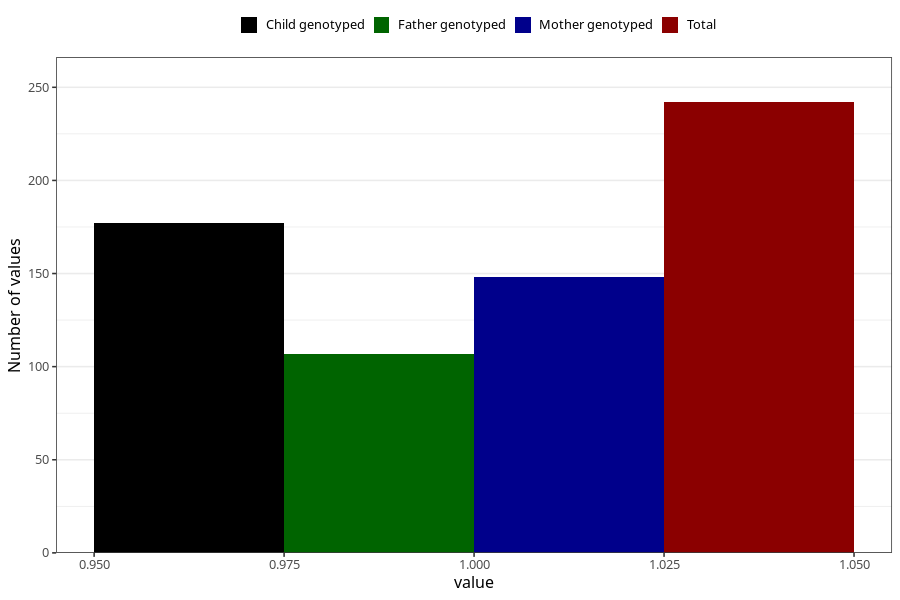

# epilepsy_8y
Variable mapping to questionnaire: q9, question NN29.
- Number of values:

| Value | Total | Child genotyped | Mother genotyped | Father genotyped |
| ----- | ----- | --------------- | ---------------- | ---------------- |
| Missing | 113381 | 75273 | 71621 | 50111 |
| Non-missing | 242 | 158 | 148 | 107 |
| 1 | 242 | 158 | 148 | 107 |

