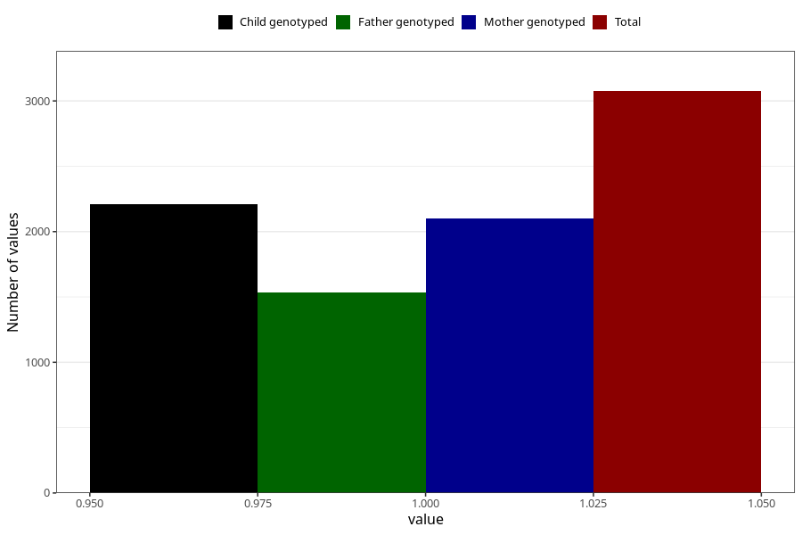

# fracture_injuries_7y
Variable mapping to questionnaire: q8, question JJ433.
- Number of values:

| Value | Total | Child genotyped | Mother genotyped | Father genotyped |
| ----- | ----- | --------------- | ---------------- | ---------------- |
| Missing | 110548 | 73222 | 69665 | 48686 |
| Non-missing | 3075 | 2209 | 2104 | 1532 |
| 1 | 3075 | 2209 | 2104 | 1532 |

