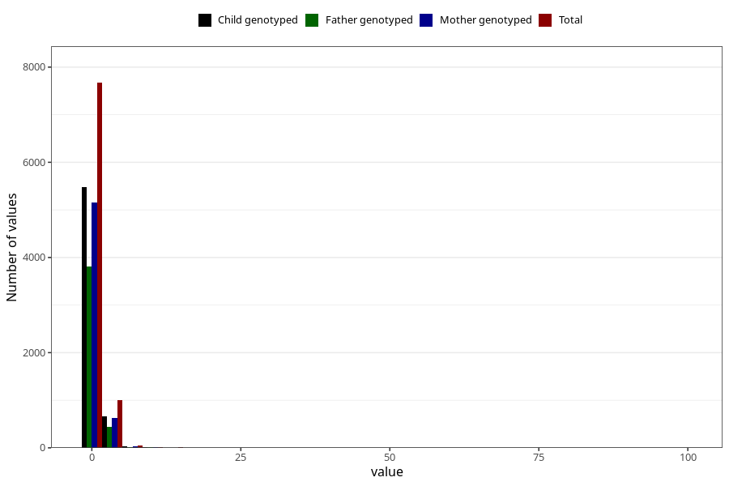

# gastric_flu_diarrhoea_freq_6m
Variable mapping to questionnaire: q4, question DD284.
- Number of values:

| Value | Total | Child genotyped | Mother genotyped | Father genotyped |
| ----- | ----- | --------------- | ---------------- | ---------------- |
| Missing | 104871 | 69231 | 65935 | 45939 |
| Non-missing | 8752 | 6200 | 5834 | 4279 |
| 25th percentile | 1 | 1 | 1 | 1 |
| 50th percentile | 1 | 1 | 1 | 1 |
| 75th percentile | 1 | 1 | 1 | 1 |

