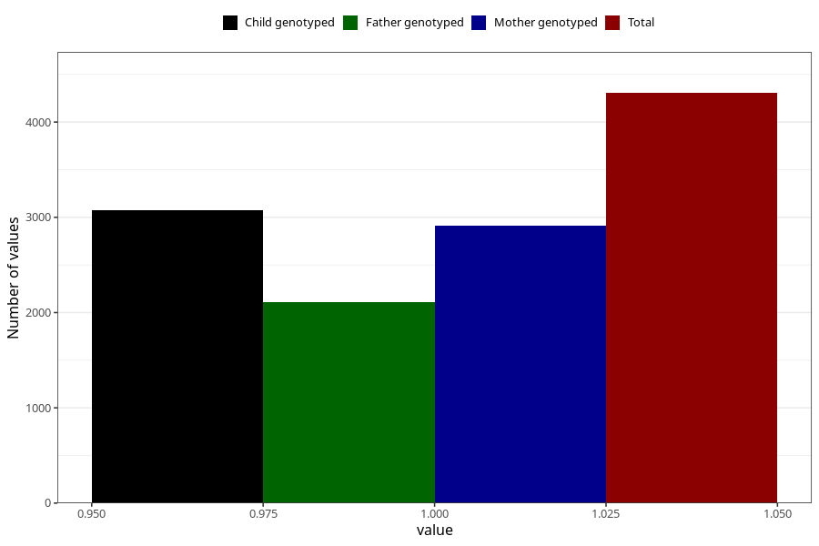

# had_an_ear_drain_7y
Variable mapping to questionnaire: q8, question JJ440.
- Number of values:

| Value | Total | Child genotyped | Mother genotyped | Father genotyped |
| ----- | ----- | --------------- | ---------------- | ---------------- |
| Missing | 109318 | 72356 | 68857 | 48112 |
| Non-missing | 4305 | 3075 | 2912 | 2106 |
| 1 | 4305 | 3075 | 2912 | 2106 |

