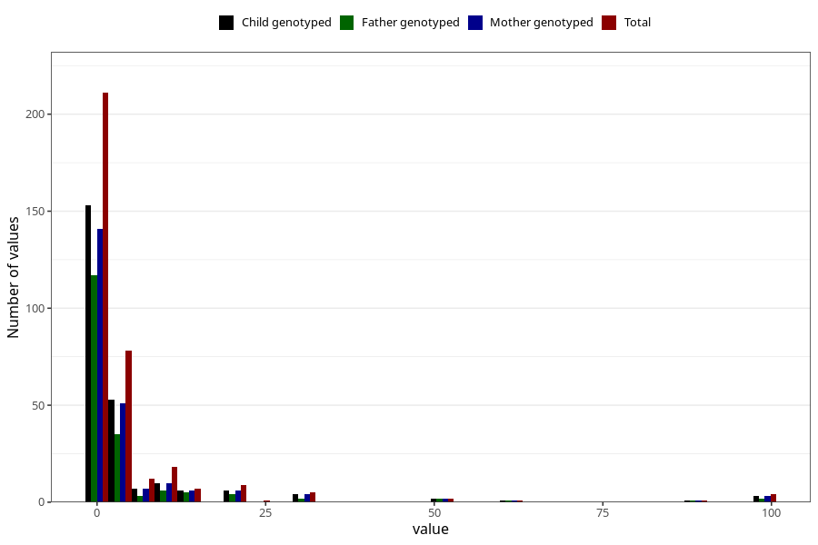

# other_convulsions_with_any_fever_freq_6m
Variable mapping to questionnaire: q4, question DD300.
- Number of values:

| Value | Total | Child genotyped | Mother genotyped | Father genotyped |
| ----- | ----- | --------------- | ---------------- | ---------------- |
| Missing | 113274 | 75185 | 71537 | 50040 |
| Non-missing | 349 | 246 | 232 | 178 |
| 25th percentile | 0 | 0 | 0 | 0 |
| 50th percentile | 1 | 1 | 1 | 1 |
| 75th percentile | 3 | 3 | 3 | 3 |

