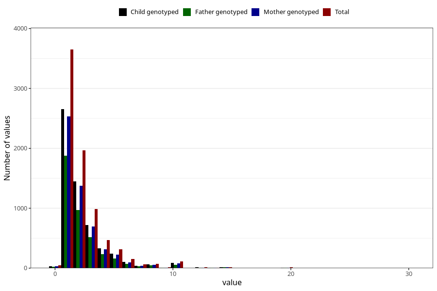

# pseudo_croup_freq_3y
Variable mapping to questionnaire: q6, question GG141.
- Number of values:

| Value | Total | Child genotyped | Mother genotyped | Father genotyped |
| ----- | ----- | --------------- | ---------------- | ---------------- |
| Missing | 105733 | 77112 | 66254 | 46197 |
| Non-missing | 7890 | 6243 | 5515 | 4021 |
| 25th percentile | 1 | 1 | 1 | 1 |
| 50th percentile | 2 | 2 | 2 | 2 |
| 75th percentile | 3 | 3 | 3 | 3 |

