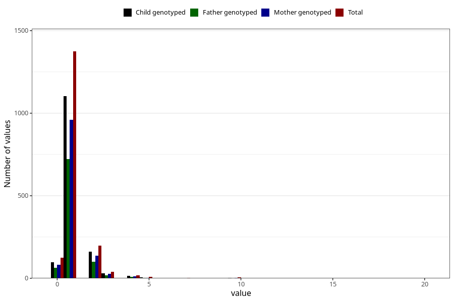

# pseudocroup_freq_6m
Variable mapping to questionnaire: q4, question DD276.
- Number of values:

| Value | Total | Child genotyped | Mother genotyped | Father genotyped |
| ----- | ----- | --------------- | ---------------- | ---------------- |
| Missing | 111851 | 74136 | 70543 | 49300 |
| Non-missing | 1772 | 1295 | 1226 | 918 |
| 0 | 125 | 88 | 82 | 65 |
| 1 | 1374 | 1012 | 961 | 722 |
| 2 | 197 | 145 | 136 | 99 |
| 3 | 39 | 29 | 26 | 18 |
| 4 | 17 | 12 | 12 | 9 |
| 5 | 8 | 4 | 4 | 4 |
| 6 | 1 | 0 | 0 | 0 |
| 7 | 2 | 0 | 0 | 0 |
| 8 | 1 | 1 | 1 | 0 |
| 10 | 5 | 3 | 3 | 1 |
| 12 | 1 | 0 | 0 | 0 |
| 14 | 1 | 1 | 1 | 0 |
| 20 | 1 | 0 | 0 | 0 |

