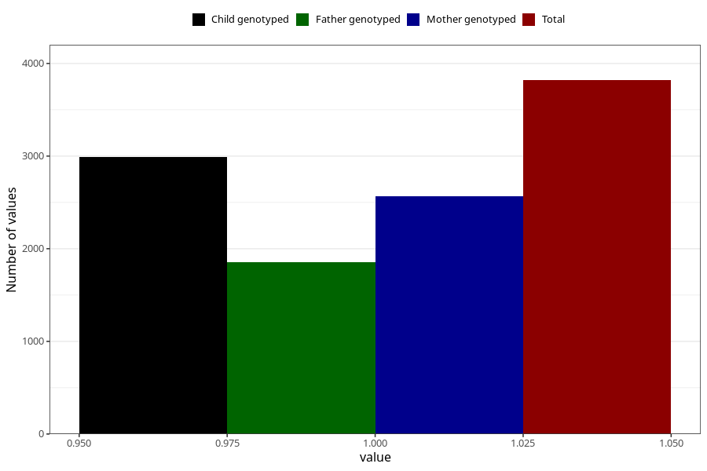

# removed_tonsils_7y
Variable mapping to questionnaire: q8, question JJ439.
- Number of values:

| Value | Total | Child genotyped | Mother genotyped | Father genotyped |
| ----- | ----- | --------------- | ---------------- | ---------------- |
| Missing | 109804 | 72724 | 69204 | 48365 |
| Non-missing | 3819 | 2707 | 2565 | 1853 |
| 1 | 3819 | 2707 | 2565 | 1853 |

