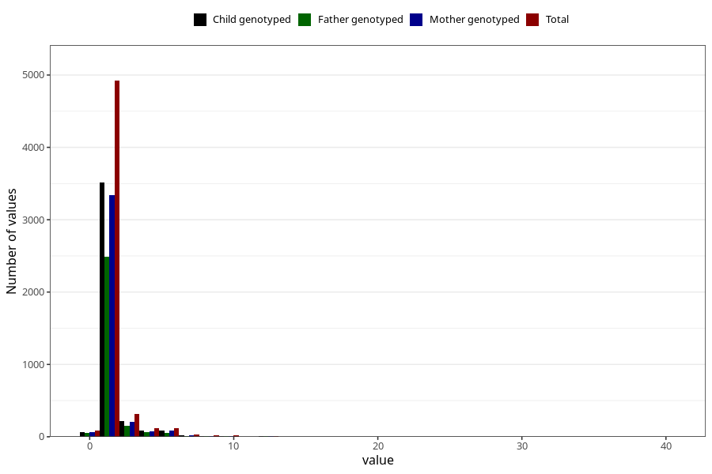

# throat_infection_confirmed_streptococci_freq_3y
Variable mapping to questionnaire: q6, question GG132.
- Number of values:

| Value | Total | Child genotyped | Mother genotyped | Father genotyped |
| ----- | ----- | --------------- | ---------------- | ---------------- |
| Missing | 107988 | 78909 | 67939 | 47364 |
| Non-missing | 5635 | 4446 | 3830 | 2854 |
| 0 | 86 | 75 | 64 | 48 |
| 1 | 3970 | 3117 | 2722 | 2035 |
| 2 | 951 | 752 | 622 | 452 |
| 3 | 313 | 243 | 206 | 154 |
| 4 | 118 | 92 | 73 | 62 |
| 5 | 66 | 58 | 52 | 35 |
| 6 | 49 | 39 | 35 | 23 |
| 7 | 26 | 22 | 19 | 13 |
| 8 | 18 | 16 | 11 | 12 |
| 10 | 20 | 16 | 12 | 10 |
| 11 | 1 | 1 | 1 | 1 |
| 12 | 4 | 4 | 4 | 3 |
| 13 | 2 | 2 | 2 | 2 |
| 14 | 3 | 3 | 3 | 2 |
| 15 | 2 | 2 | 2 | 2 |
| 20 | 3 | 2 | 1 | 0 |
| 21 | 1 | 1 | 0 | 0 |
| 30 | 1 | 0 | 0 | 0 |
| 40 | 1 | 1 | 1 | 0 |

