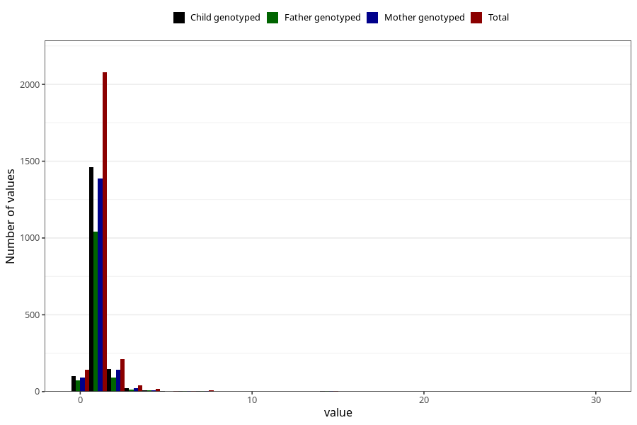

# throat_infection_freq_6m
Variable mapping to questionnaire: q4, question DD268.
- Number of values:

| Value | Total | Child genotyped | Mother genotyped | Father genotyped |
| ----- | ----- | --------------- | ---------------- | ---------------- |
| Missing | 111111 | 73675 | 70105 | 48976 |
| Non-missing | 2512 | 1756 | 1664 | 1242 |
| 0 | 144 | 100 | 92 | 75 |
| 1 | 2078 | 1463 | 1385 | 1043 |
| 2 | 212 | 147 | 143 | 93 |
| 3 | 43 | 22 | 21 | 13 |
| 4 | 16 | 9 | 9 | 7 |
| 5 | 2 | 2 | 1 | 1 |
| 6 | 6 | 6 | 6 | 4 |
| 7 | 7 | 4 | 4 | 3 |
| 12 | 1 | 1 | 1 | 1 |
| 14 | 2 | 2 | 2 | 2 |
| 30 | 1 | 0 | 0 | 0 |

