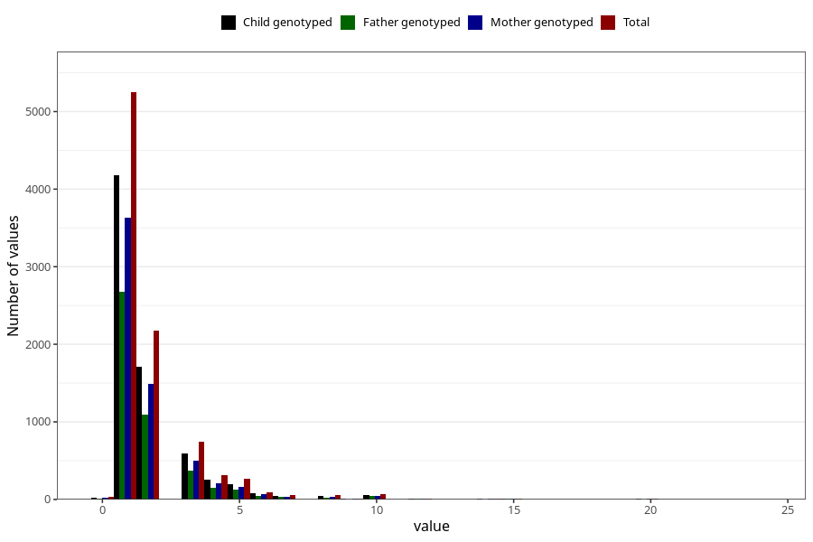

# throat_infection_other_freq_3y
Variable mapping to questionnaire: q6, question GG135.
- Number of values:

| Value | Total | Child genotyped | Mother genotyped | Father genotyped |
| ----- | ----- | --------------- | ---------------- | ---------------- |
| Missing | 104516 | 76126 | 65523 | 45615 |
| Non-missing | 9107 | 7229 | 6246 | 4603 |
| 25th percentile | 1 | 1 | 1 | 1 |
| 50th percentile | 1 | 1 | 1 | 1 |
| 75th percentile | 2 | 2 | 2 | 2 |

