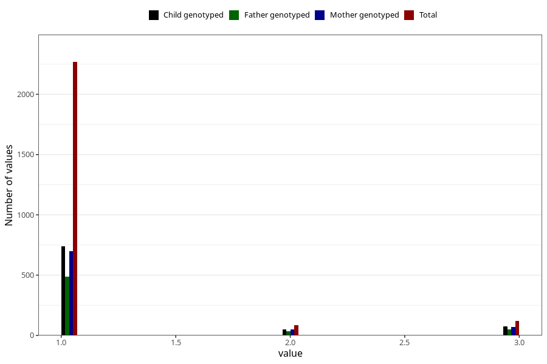

# vaccine_bcg_freq_18m
Variable mapping to questionnaire: q5, question EE166.
- Number of values:

| Value | Total | Child genotyped | Mother genotyped | Father genotyped |
| ----- | ----- | --------------- | ---------------- | ---------------- |
| Missing | 111152 | 74572 | 70949 | 49645 |
| Non-missing | 2471 | 859 | 820 | 573 |
| 1 | 2268 | 738 | 701 | 486 |
| 2 | 85 | 48 | 48 | 37 |
| 3 | 118 | 73 | 71 | 50 |

