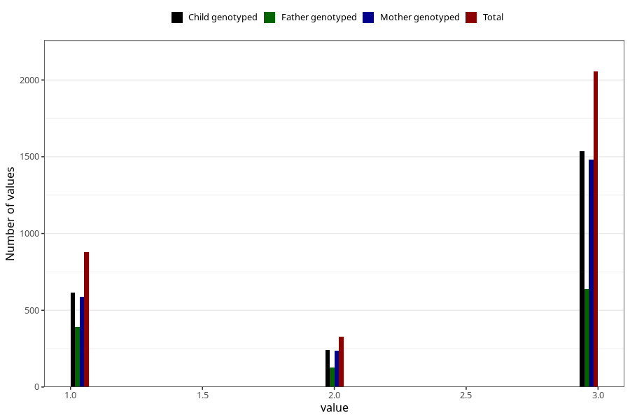

# vaccine_dt_freq_18m
Variable mapping to questionnaire: q5, question EE154.
- Number of values:

| Value | Total | Child genotyped | Mother genotyped | Father genotyped |
| ----- | ----- | --------------- | ---------------- | ---------------- |
| Missing | 110362 | 73042 | 69466 | 49065 |
| Non-missing | 3261 | 2389 | 2303 | 1153 |
| 1 | 880 | 616 | 586 | 391 |
| 2 | 326 | 239 | 235 | 126 |
| 3 | 2055 | 1534 | 1482 | 636 |

