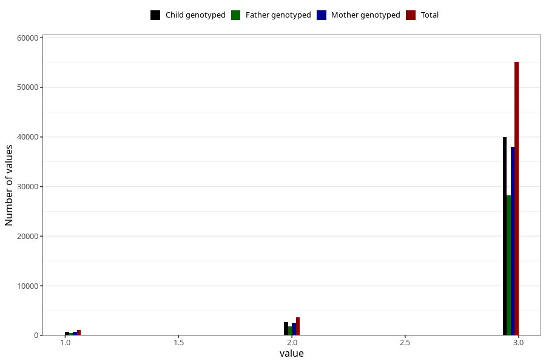

# vaccine_hib_freq_18m
Variable mapping to questionnaire: q5, question EE784.
- Number of values:

| Value | Total | Child genotyped | Mother genotyped | Father genotyped |
| ----- | ----- | --------------- | ---------------- | ---------------- |
| Missing | 53700 | 32032 | 30504 | 19651 |
| Non-missing | 59923 | 43399 | 41265 | 30567 |
| 1 | 1123 | 763 | 718 | 523 |
| 2 | 3689 | 2622 | 2500 | 1800 |
| 3 | 55111 | 40014 | 38047 | 28244 |

