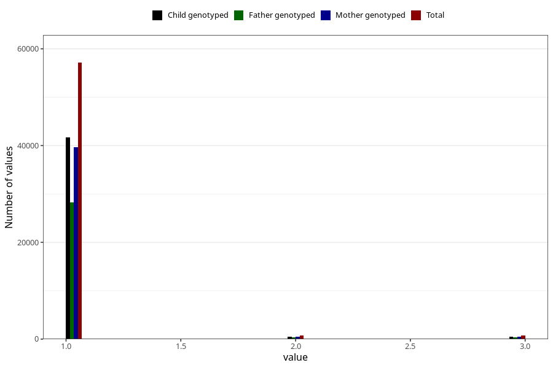

# vaccine_mmr_freq_18m
Variable mapping to questionnaire: q5, question EE160.
- Number of values:

| Value | Total | Child genotyped | Mother genotyped | Father genotyped |
| ----- | ----- | --------------- | ---------------- | ---------------- |
| Missing | 55109 | 32823 | 31193 | 21350 |
| Non-missing | 58514 | 42608 | 40576 | 28868 |
| 1 | 57136 | 41645 | 39663 | 28247 |
| 2 | 693 | 461 | 444 | 304 |
| 3 | 685 | 502 | 469 | 317 |

