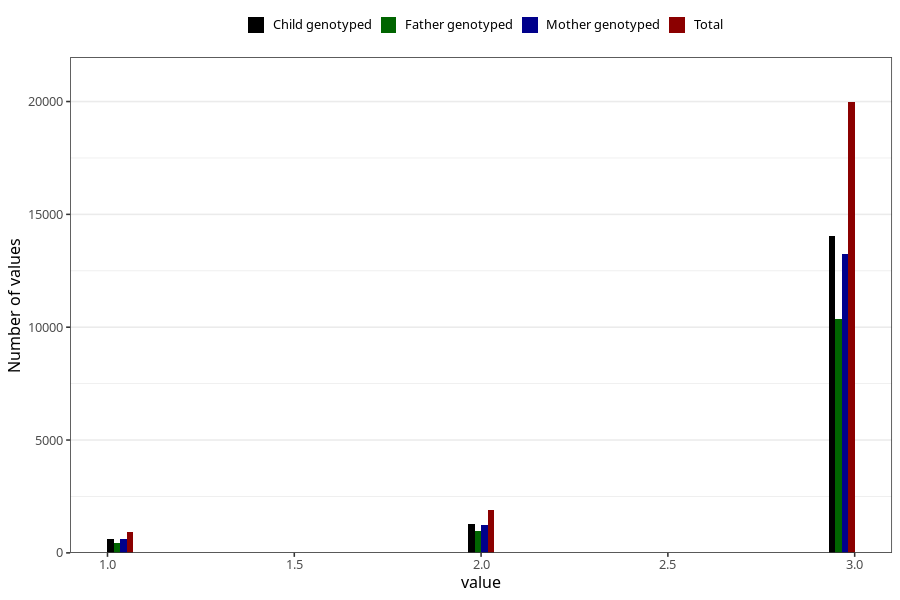

# vaccine_pneumococcus_freq_18m
Variable mapping to questionnaire: q5, question EE1009.
- Number of values:

| Value | Total | Child genotyped | Mother genotyped | Father genotyped |
| ----- | ----- | --------------- | ---------------- | ---------------- |
| Missing | 90843 | 59451 | 56691 | 38462 |
| Non-missing | 22780 | 15980 | 15078 | 11756 |
| 1 | 908 | 630 | 594 | 457 |
| 2 | 1901 | 1292 | 1227 | 947 |
| 3 | 19971 | 14058 | 13257 | 10352 |

