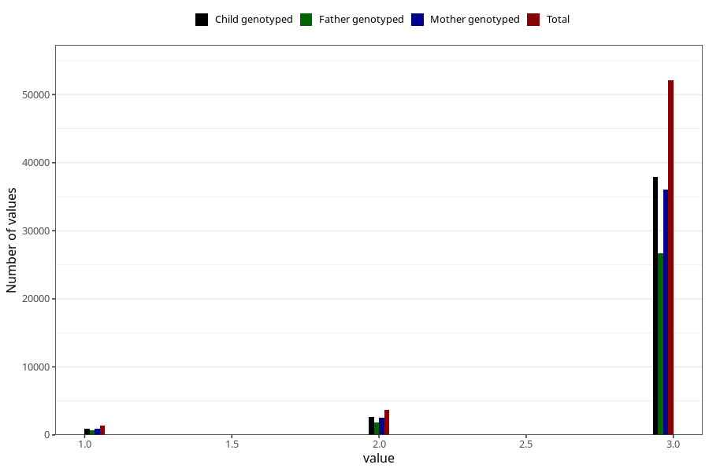

# vaccine_polio_freq_18m
Variable mapping to questionnaire: q5, question EE956.
- Number of values:

| Value | Total | Child genotyped | Mother genotyped | Father genotyped |
| ----- | ----- | --------------- | ---------------- | ---------------- |
| Missing | 56407 | 33942 | 32335 | 21124 |
| Non-missing | 57216 | 41489 | 39434 | 29094 |
| 1 | 1395 | 934 | 879 | 632 |
| 2 | 3726 | 2655 | 2522 | 1816 |
| 3 | 52095 | 37900 | 36033 | 26646 |

