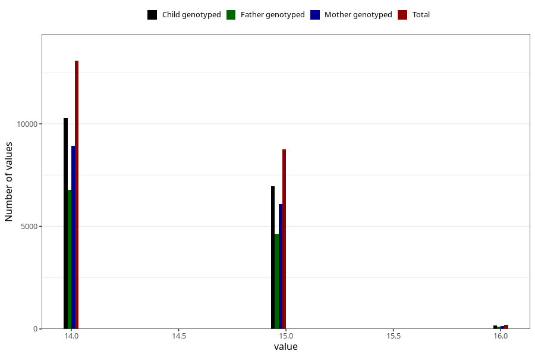

# youth_self_age
Variable mapping to questionnaire: ungdomsskjema_barn, question AGE_YRS_UB.
- Number of values:

| Value | Total | Child genotyped | Mother genotyped | Father genotyped |
| ----- | ----- | --------------- | ---------------- | ---------------- |
| Missing | 91579 | 59454 | 56582 | 38707 |
| Non-missing | 22044 | 15977 | 15187 | 11511 |
| 14 | 13073 | 9411 | 8938 | 6778 |
| 15 | 8765 | 6404 | 6100 | 4627 |
| 16 | 206 | 162 | 149 | 106 |

