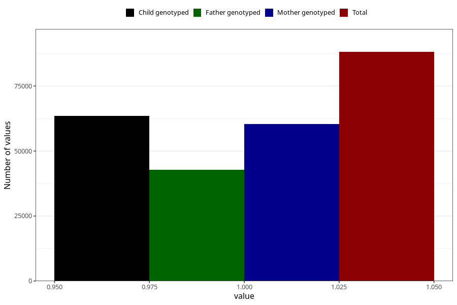

# breastmilk_0m
Variable mapping to questionnaire: q4, question DD49.
- Number of values:

| Value | Total | Child genotyped | Mother genotyped | Father genotyped |
| ----- | ----- | --------------- | ---------------- | ---------------- |
| Missing | 25530 | 11969 | 11352 | 7497 |
| Non-missing | 88093 | 63462 | 60417 | 42721 |
| 1 | 88093 | 63462 | 60417 | 42721 |

