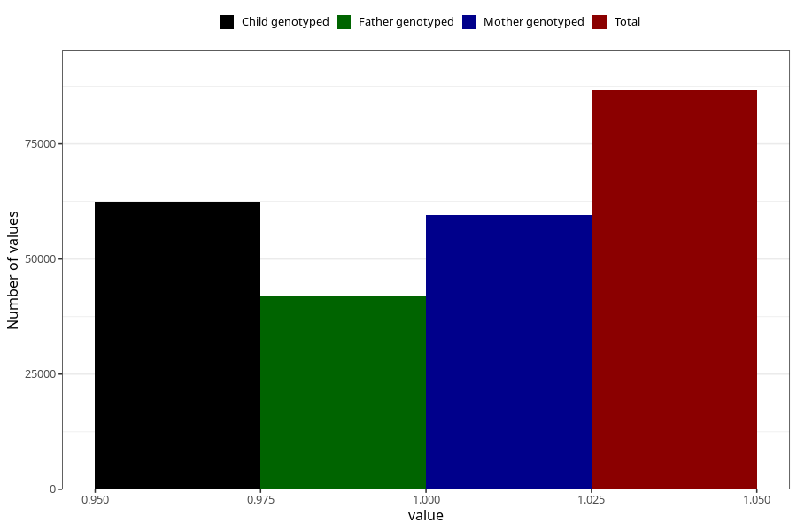

# breastmilk_1m
Variable mapping to questionnaire: q4, question DD50.
- Number of values:

| Value | Total | Child genotyped | Mother genotyped | Father genotyped |
| ----- | ----- | --------------- | ---------------- | ---------------- |
| Missing | 27015 | 12993 | 12316 | 8163 |
| Non-missing | 86608 | 62438 | 59453 | 42055 |
| 1 | 86608 | 62438 | 59453 | 42055 |

