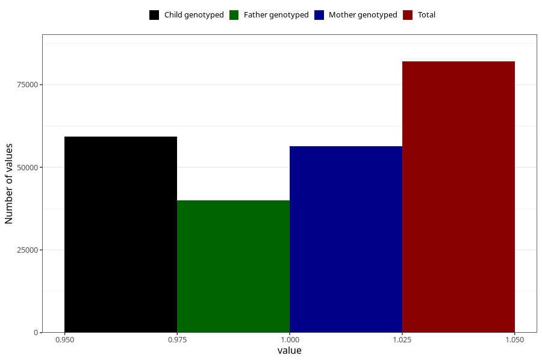

# breastmilk_3m
Variable mapping to questionnaire: q4, question DD52.
- Number of values:

| Value | Total | Child genotyped | Mother genotyped | Father genotyped |
| ----- | ----- | --------------- | ---------------- | ---------------- |
| Missing | 31634 | 18430 | 15334 | 10179 |
| Non-missing | 81989 | 64925 | 56435 | 40039 |
| 1 | 81989 | 64925 | 56435 | 40039 |

