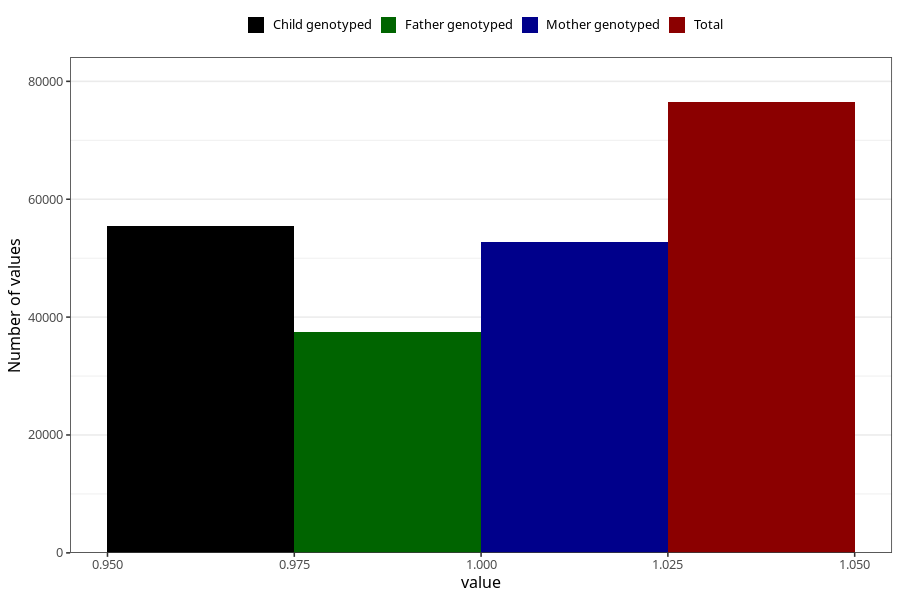

# breastmilk_5m
Variable mapping to questionnaire: q4, question DD54.
- Number of values:

| Value | Total | Child genotyped | Mother genotyped | Father genotyped |
| ----- | ----- | --------------- | ---------------- | ---------------- |
| Missing | 37161 | 19965 | 18943 | 12691 |
| Non-missing | 76462 | 55466 | 52826 | 37527 |
| 1 | 76462 | 55466 | 52826 | 37527 |

