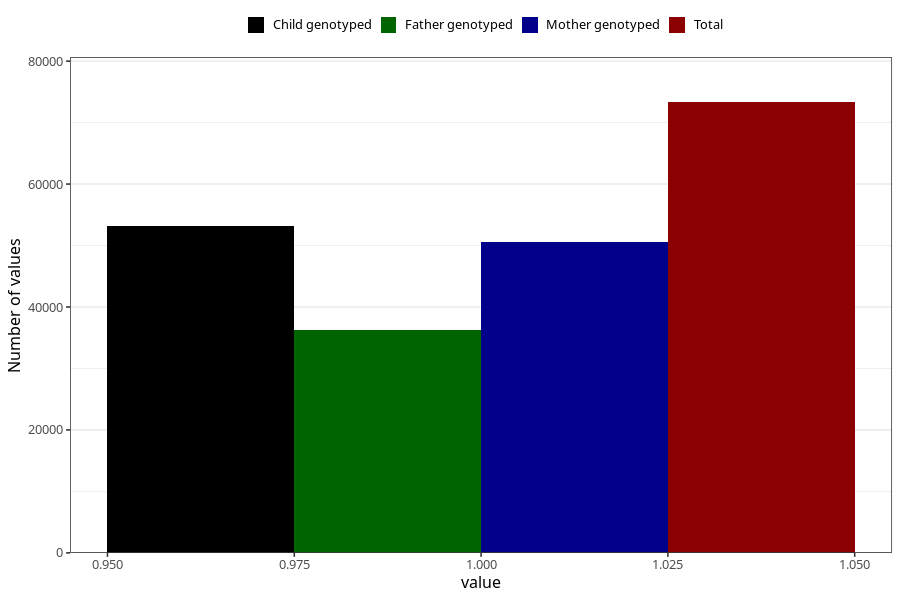

# breastmilk_6m
Variable mapping to questionnaire: q4, question DD55.
- Number of values:

| Value | Total | Child genotyped | Mother genotyped | Father genotyped |
| ----- | ----- | --------------- | ---------------- | ---------------- |
| Missing | 40304 | 22240 | 21123 | 13892 |
| Non-missing | 73319 | 53191 | 50646 | 36326 |
| 1 | 73319 | 53191 | 50646 | 36326 |

