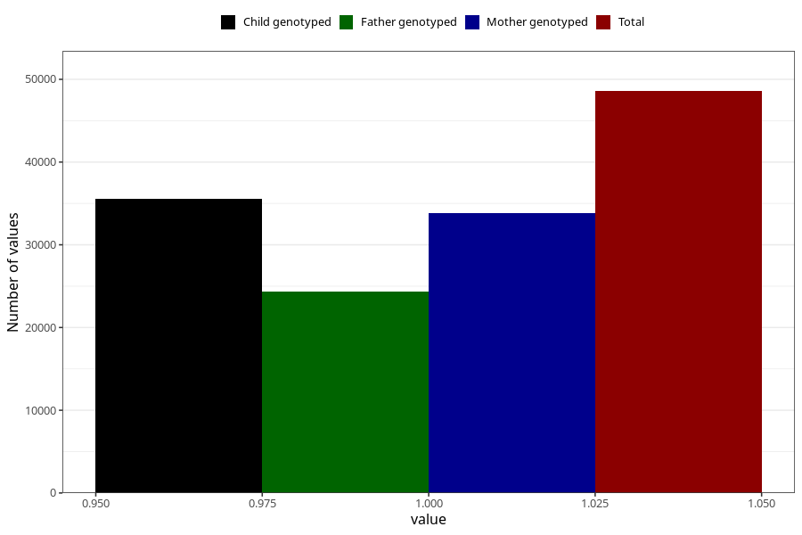

# breastmilk_9_11m
Variable mapping to questionnaire: q5, question EE13.
- Number of values:

| Value | Total | Child genotyped | Mother genotyped | Father genotyped |
| ----- | ----- | --------------- | ---------------- | ---------------- |
| Missing | 65048 | 44542 | 37911 | 25899 |
| Non-missing | 48575 | 38813 | 33858 | 24319 |
| 1 | 48575 | 38813 | 33858 | 24319 |

