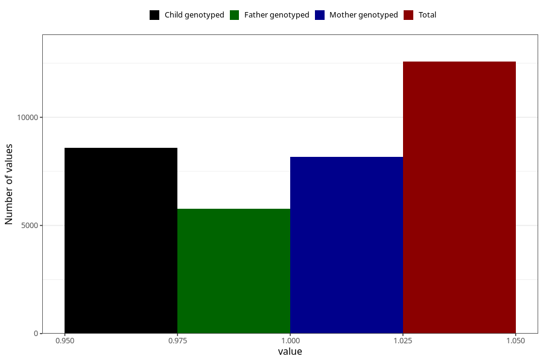

# formula_0m
- Number of values:

| Value | Total | Child genotyped | Mother genotyped | Father genotyped |
| ----- | ----- | --------------- | ---------------- | ---------------- |
| Missing | 101050 | 73744 | 63598 | 44449 |
| Non-missing | 12573 | 9611 | 8171 | 5769 |
| 1 | 12573 | 9611 | 8171 | 5769 |

