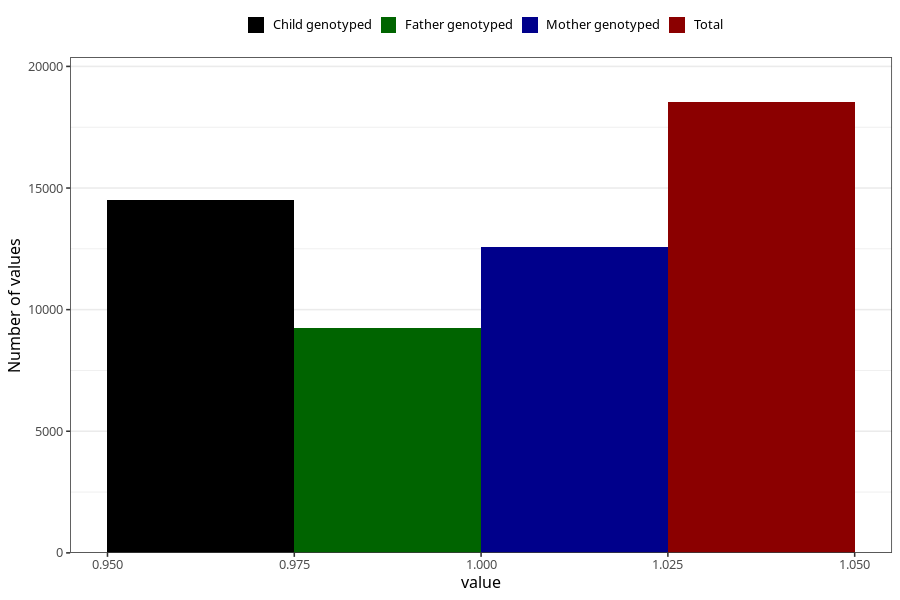

# formula_12_14m
Variable mapping to questionnaire: q5, question EE18.
- Number of values:

| Value | Total | Child genotyped | Mother genotyped | Father genotyped |
| ----- | ----- | --------------- | ---------------- | ---------------- |
| Missing | 95095 | 62224 | 59190 | 40989 |
| Non-missing | 18528 | 13207 | 12579 | 9229 |
| 1 | 18528 | 13207 | 12579 | 9229 |

