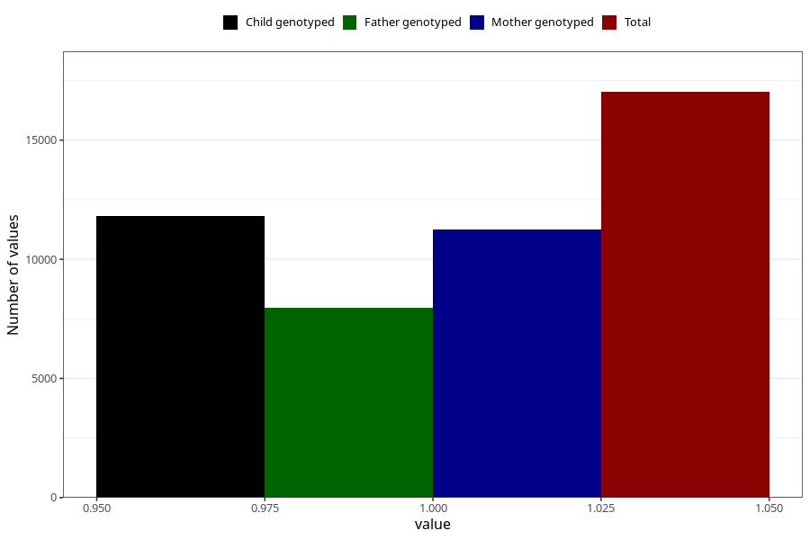

# formula_2m
- Number of values:

| Value | Total | Child genotyped | Mother genotyped | Father genotyped |
| ----- | ----- | --------------- | ---------------- | ---------------- |
| Missing | 96603 | 70266 | 60515 | 42261 |
| Non-missing | 17020 | 13089 | 11254 | 7957 |
| 1 | 17020 | 13089 | 11254 | 7957 |

