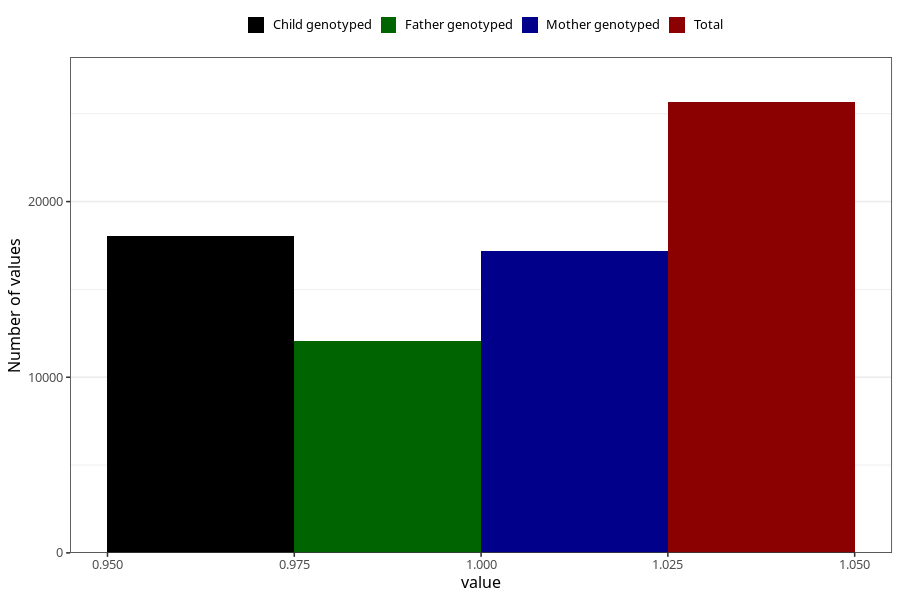

# formula_4m
- Number of values:

| Value | Total | Child genotyped | Mother genotyped | Father genotyped |
| ----- | ----- | --------------- | ---------------- | ---------------- |
| Missing | 87963 | 57408 | 54600 | 38131 |
| Non-missing | 25660 | 18023 | 17169 | 12087 |
| 1 | 25660 | 18023 | 17169 | 12087 |

