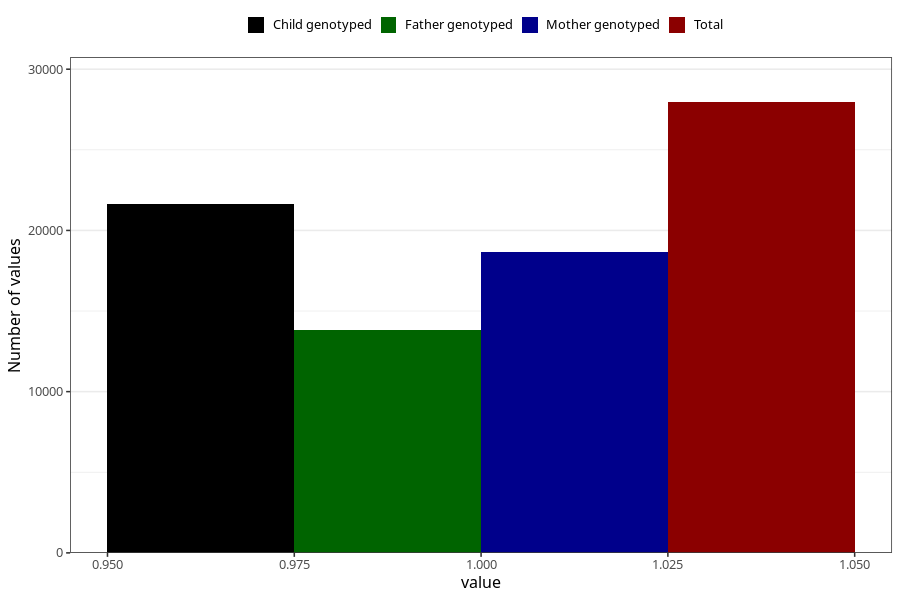

# formula_6m
- Number of values:

| Value | Total | Child genotyped | Mother genotyped | Father genotyped |
| ----- | ----- | --------------- | ---------------- | ---------------- |
| Missing | 85670 | 55750 | 53083 | 36388 |
| Non-missing | 27953 | 19681 | 18686 | 13830 |
| 1 | 27953 | 19681 | 18686 | 13830 |

