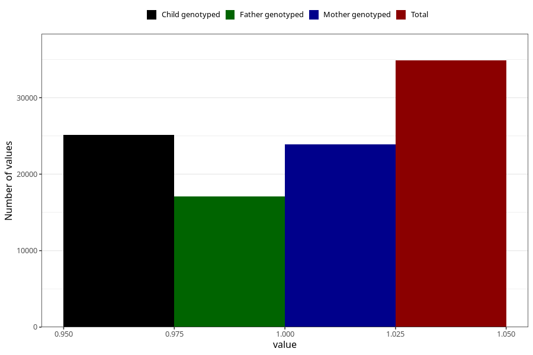

# formula_9_11m
Variable mapping to questionnaire: q5, question EE17.
- Number of values:

| Value | Total | Child genotyped | Mother genotyped | Father genotyped |
| ----- | ----- | --------------- | ---------------- | ---------------- |
| Missing | 78757 | 50333 | 47875 | 33122 |
| Non-missing | 34866 | 25098 | 23894 | 17096 |
| 1 | 34866 | 25098 | 23894 | 17096 |

