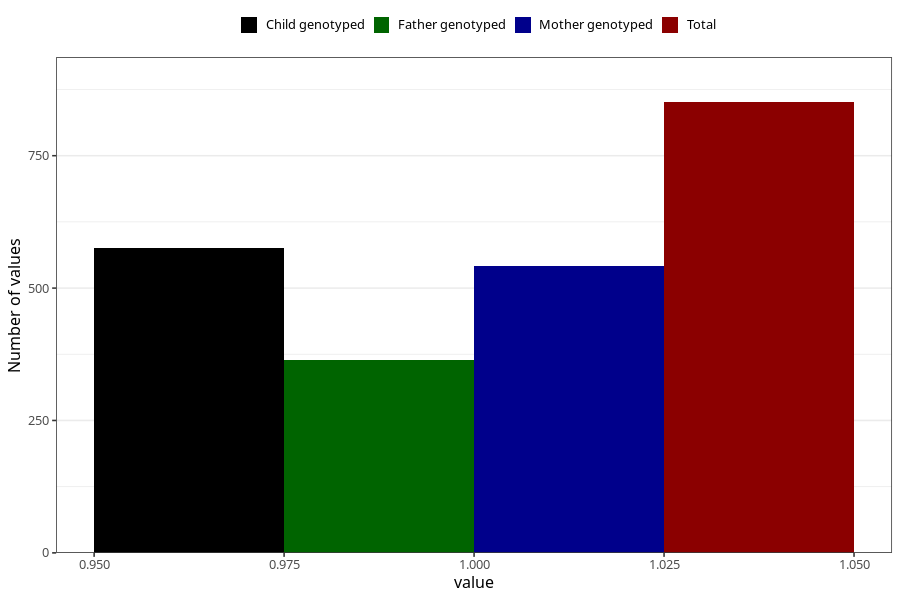

# formula_colett_2m
Variable mapping to questionnaire: q4, question DD58.
- Number of values:

| Value | Total | Child genotyped | Mother genotyped | Father genotyped |
| ----- | ----- | --------------- | ---------------- | ---------------- |
| Missing | 112772 | 74855 | 71227 | 49854 |
| Non-missing | 851 | 576 | 542 | 364 |
| 1 | 851 | 576 | 542 | 364 |

