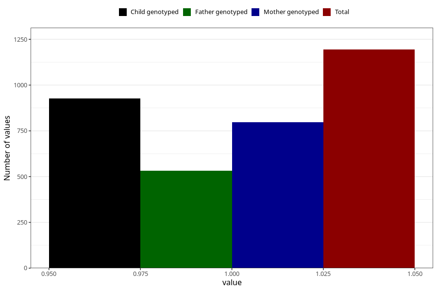

# formula_colett_5m
Variable mapping to questionnaire: q4, question DD61.
- Number of values:

| Value | Total | Child genotyped | Mother genotyped | Father genotyped |
| ----- | ----- | --------------- | ---------------- | ---------------- |
| Missing | 112429 | 82428 | 70971 | 49687 |
| Non-missing | 1194 | 927 | 798 | 531 |
| 1 | 1194 | 927 | 798 | 531 |

