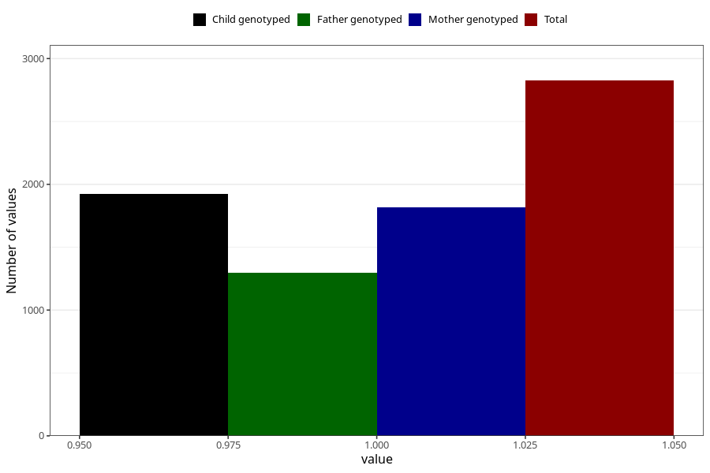

# formula_colett_omega3_0m
Variable mapping to questionnaire: q4, question DD63.
- Number of values:

| Value | Total | Child genotyped | Mother genotyped | Father genotyped |
| ----- | ----- | --------------- | ---------------- | ---------------- |
| Missing | 110798 | 73508 | 69953 | 48924 |
| Non-missing | 2825 | 1923 | 1816 | 1294 |
| 1 | 2825 | 1923 | 1816 | 1294 |

