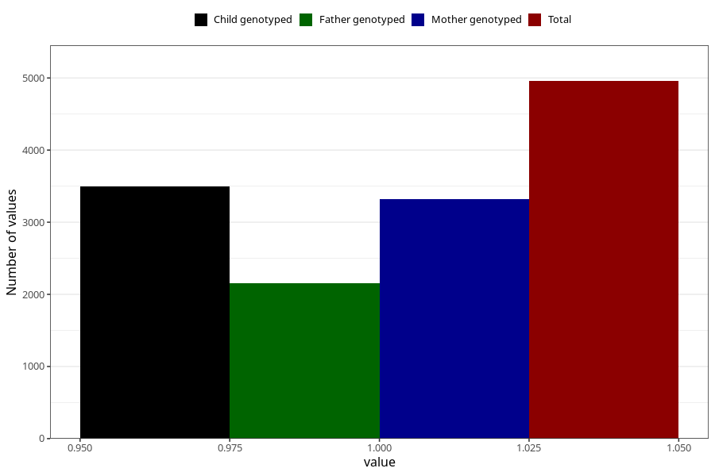

# formula_colett_omega3_5m
Variable mapping to questionnaire: q4, question DD68.
- Number of values:

| Value | Total | Child genotyped | Mother genotyped | Father genotyped |
| ----- | ----- | --------------- | ---------------- | ---------------- |
| Missing | 108666 | 79497 | 68454 | 48059 |
| Non-missing | 4957 | 3858 | 3315 | 2159 |
| 1 | 4957 | 3858 | 3315 | 2159 |

