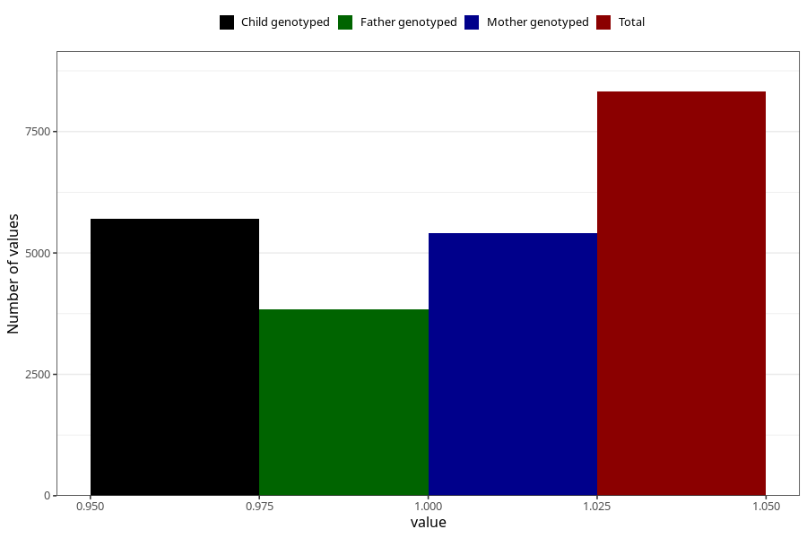

# formula_nan_1m
Variable mapping to questionnaire: q4, question DD71.
- Number of values:

| Value | Total | Child genotyped | Mother genotyped | Father genotyped |
| ----- | ----- | --------------- | ---------------- | ---------------- |
| Missing | 105301 | 69725 | 66354 | 46381 |
| Non-missing | 8322 | 5706 | 5415 | 3837 |
| 1 | 8322 | 5706 | 5415 | 3837 |

