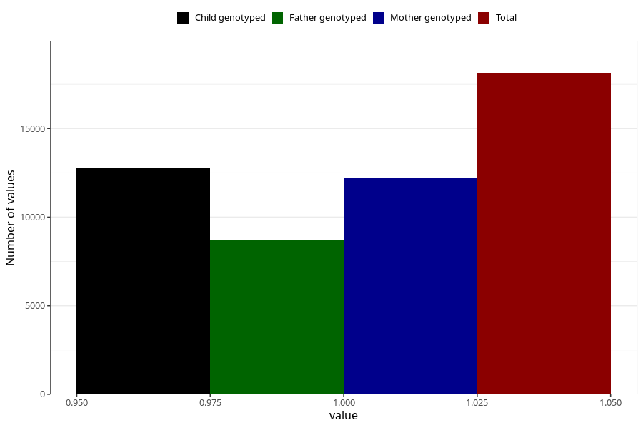

# formula_nan_4m
Variable mapping to questionnaire: q4, question DD74.
- Number of values:

| Value | Total | Child genotyped | Mother genotyped | Father genotyped |
| ----- | ----- | --------------- | ---------------- | ---------------- |
| Missing | 95481 | 69300 | 59594 | 41498 |
| Non-missing | 18142 | 14055 | 12175 | 8720 |
| 1 | 18142 | 14055 | 12175 | 8720 |

