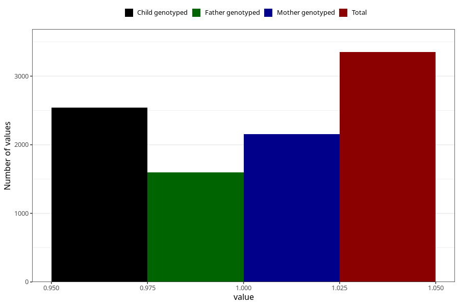

# formula_nan_ha1_0m
Variable mapping to questionnaire: q4, question DD77.
- Number of values:

| Value | Total | Child genotyped | Mother genotyped | Father genotyped |
| ----- | ----- | --------------- | ---------------- | ---------------- |
| Missing | 110273 | 73160 | 69615 | 48622 |
| Non-missing | 3350 | 2271 | 2154 | 1596 |
| 1 | 3350 | 2271 | 2154 | 1596 |

