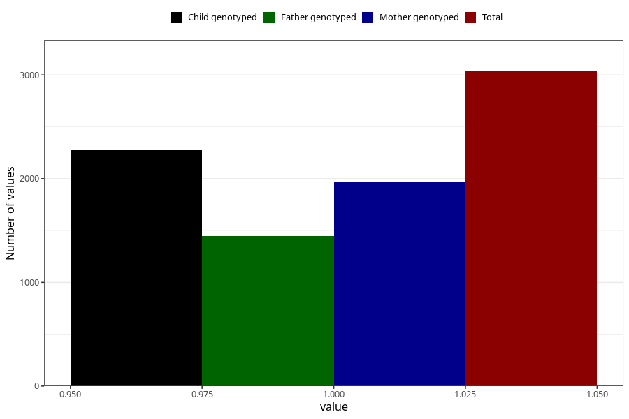

# formula_nan_ha1_4m
Variable mapping to questionnaire: q4, question DD81.
- Number of values:

| Value | Total | Child genotyped | Mother genotyped | Father genotyped |
| ----- | ----- | --------------- | ---------------- | ---------------- |
| Missing | 110589 | 73364 | 69803 | 48769 |
| Non-missing | 3034 | 2067 | 1966 | 1449 |
| 1 | 3034 | 2067 | 1966 | 1449 |

