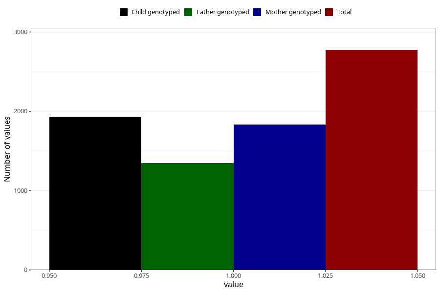

# formula_nan_ha1_5m
Variable mapping to questionnaire: q4, question DD82.
- Number of values:

| Value | Total | Child genotyped | Mother genotyped | Father genotyped |
| ----- | ----- | --------------- | ---------------- | ---------------- |
| Missing | 110849 | 81234 | 69935 | 48868 |
| Non-missing | 2774 | 2121 | 1834 | 1350 |
| 1 | 2774 | 2121 | 1834 | 1350 |

