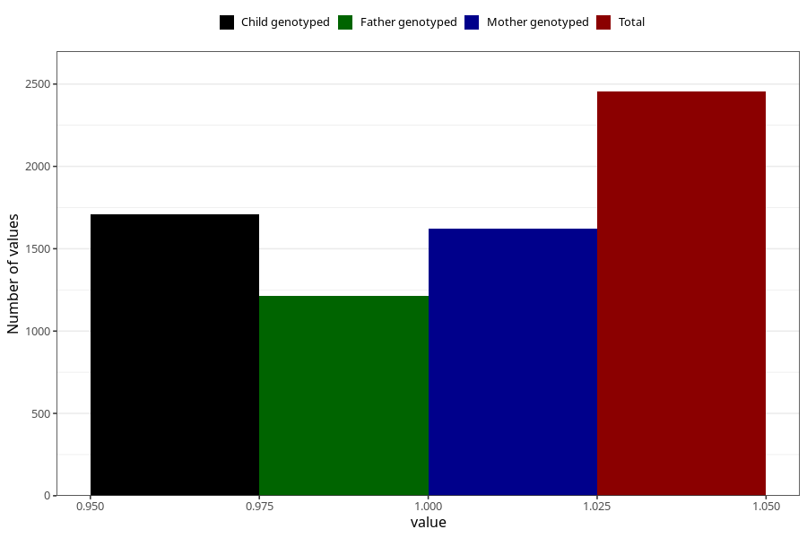

# formula_nan_ha1_6m
Variable mapping to questionnaire: q4, question DD83.
- Number of values:

| Value | Total | Child genotyped | Mother genotyped | Father genotyped |
| ----- | ----- | --------------- | ---------------- | ---------------- |
| Missing | 111169 | 73722 | 70147 | 49003 |
| Non-missing | 2454 | 1709 | 1622 | 1215 |
| 1 | 2454 | 1709 | 1622 | 1215 |

